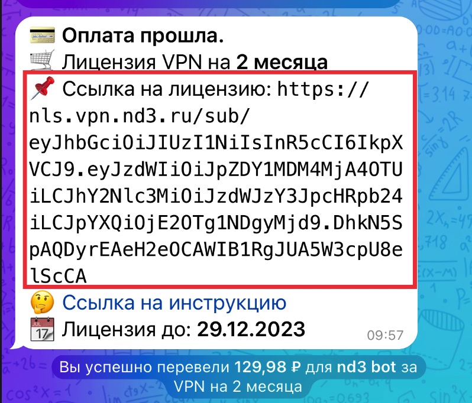
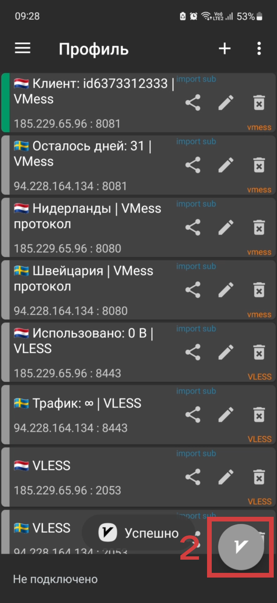

---
layout:
  title:
    visible: true
  description:
    visible: false
  tableOfContents:
    visible: true
  outline:
    visible: true
  pagination:
    visible: false
---

# v2rayNG


Ссылка на приложение: [https://play.google.com/store/apps/details?id=com.v2ray.ang](https://play.google.com/store/apps/details?id=com.v2ray.ang\&hl=ru)


## Инструкция 

### Скопируйте ссылку на лицензию из сообщения

<figure><figcaption>
Можете нажать на ссылку и она скопируется
</figcaption></figure>

### Откройте приложение v2rayNG

1. Нажмите на `+`.
2. В выплывающем меню нажмите `Импорт профиля из буфера обмена`.
3. Нажмите на три точки.
4. В выплывающем меню нажмите `Обновить подписку`.

<figure><figcaption></figcaption></figure>

 

<figure><figcaption></figcaption></figure>

 

<figure><figcaption></figcaption></figure>

 

<figure><figcaption></figcaption></figure>

***

### Включение VPN

1. Выберите локацию.
2. Нажмите на `круглую кнопку с буквой V`.

<figure><figcaption></figcaption></figure>

 

<figure><figcaption></figcaption></figure>

## Видео-инструкция


