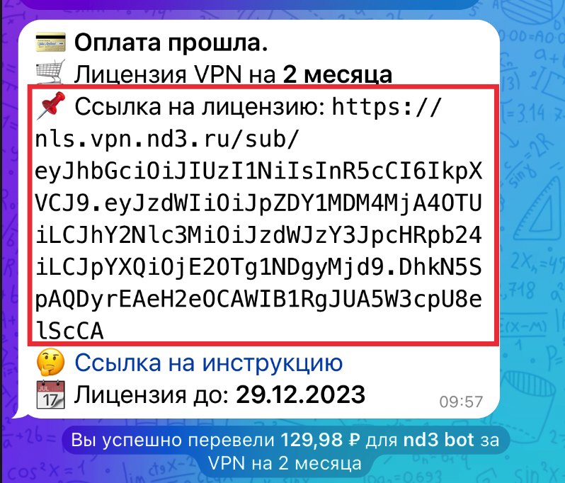
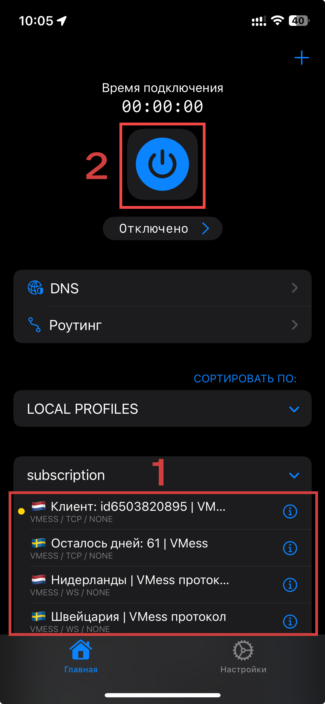

---
layout:
  title:
    visible: true
  description:
    visible: false
  tableOfContents:
    visible: true
  outline:
    visible: true
  pagination:
    visible: false
---

# Streisand


Ссылка на приложение: [https://apps.apple.com/ru/app/streisand/id6450534064](https://apps.apple.com/ru/app/streisand/id6450534064)


## Видео-инструкция



## Инструкция 

### Скопируйте ссылку на лицензию из сообщения

<figure><figcaption>
Можете нажать на ссылку и она скопируется
</figcaption></figure>

### Откройте приложение Streisand

1. Нажмите на `+`.
2. В выплывающем меню нажмите `Добавить из буфера`.
3. В появившемся меню нажмите `Разрешить вставку`.

<figure><figcaption></figcaption></figure>

 

<figure><figcaption></figcaption></figure>

 

<figure><figcaption></figcaption></figure>

***

### Включение VPN

1. Выберите локацию.
2. Нажмите `Включить`.

<figure><figcaption></figcaption></figure>

